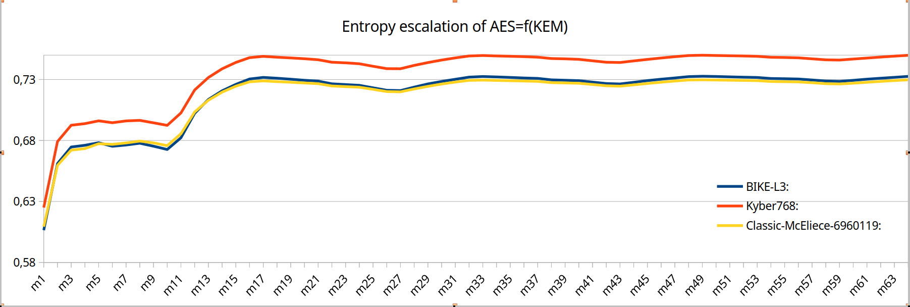

In order to produce experimental data there are three *python* files explained as follows:  
**A**:The first benchmarks KEMs execution time and AES-256-CBC=f(KEM)  execution time.  
**B**:The second executes reverse engineering ML attack against PUF, providing prediction results for the challenge.  
**C**:The third one quantifies the entropy of ciphetexts generated by AES-256-GCM session key. That key produced from the PQC KEMs. 
Scripts'  results  have been executed  by an i3 processor.  

**Repository update-1, 2025 MAR 17**:  
In order to create data series, generated after the execution, the plots placed in comments and data produced are appended in stats.csv. Related, there is an enhancement of the C.Entropy.py script and hence, the entropy differences between the ciphertexts have been mitigated but, still there are in the context of the initial commitment, as shown in the image.The raw data are at the C.stats.csv. The rational is to keep the AES initialation vector common for the same iteration, in order to evaluate the entropy  and relate it to each KEM.   

